## Pricing-Intangibles

To Do:

Download LIQ Factor

\[ \] Write ‘ReadMe’s’ for every auxiliary File

Find out how to produce them with plots (-&gt; maybe straight KNitR
them?)

Do the LIQ ~ F\_INT, & LIQ ~ FF regressions

Fucking get behind how to fix this fucking shit of a whore piece of git
connection without suing github desktop those bunch of motherless
sloths. die -&gt; did it (will keep this as a memento tho)

Show the difference of the Factors when RMW is divided by be, or by
be\_int

MY BROTHER IN CHRIST: we forgot about the market factor. (did we?) -&gt;
check this straight after coming back from the doc!

\#List of test plots:

\[x\] All the recreated fama french factors with the originals.

\[x\] All the intangible factors with the recreated fff.

\[x\] The two different rmw\_int factors

(\[x\] The different HML Factors)

\[x\] The Traded Liquidity Factor

\#List of all the test tables:

\[x\] All the recreated factors with the originals

\[ \] Liq ~ FF5 OG

\[ \] Liq ~ FF5 Int

\#List of all factors and their composition:

\[ \] All the original FF5

\[ \] All the Int FF5 recreated

\[ \] HML original and RMW Original

\[ \] The Liquidity Factor

## A Factor Model

Regressing the excess returns stock returns on different “factors” that
have proven to carry explanatory power:

*R**e**t**u**r**n**i*, *t* = *α**i* + *β**i*, *t**M**K**T*(*R**t**M**K**T*−*R**t**f*) + *β**i*, *t**S**Z**S**I**Z**E**t* + *β**i*, *t**B**M**H**M**L**t*

 + *β**i*, *t**O**P**R**M**W**t* + *β**i*, *t**I**N**V**C**M**A**t* + *ϵ**i*, *t*

#### The Standard FF-3 Factor Model:

1.  Excess Market Return

2.  Firm Size

3.  Book-to-Market Equity Ratio

#### The FF-5 Factor Model:

1.  Operating Profitability

2.  Firm’s Investments

## Factor Composition

Model:
*Y* = *M**K**T* + *S**I**Z**E* + *H**M**L* + *R**M**W* + *C**M**A*

$$
\begin{aligned}
HML\_{FF} & \rightarrow HML\_{INT} & \text{\[Eisfeldt e.a., 2021\]} \\ 
RMW\_{FF} & \rightarrow RMW\_{INT} & \text{\[Wang, 2023\]} \\
CMA\_{FF} & \rightarrow CMA\_{INT} & \text{\[Jagannathan e.a., 2023\]}
\end{aligned}
$$

E.g., the composition of the *H**M**L**I**N**T* factor is:

*B**E**i*, *t**I**N**T* = *B**E**i*, *t**F**F* − *G**D**W**L**i*, *t* + *I**N**T**i*, *t*

*I**N**T**i*, *t* = (1−*δ*)*I**N**T**i*, *t* − 1 + *S**G*&*A**i**t*,

where *I**N**T**i*, 0 = *S**G*&*A**i*1/(*g*+*δ*),

with $ g = 0.1 $ and a proposed *δ* = 0.2 from \[Eisfeldt & Papanikolau,
2014\].

## Reproduction of Factors

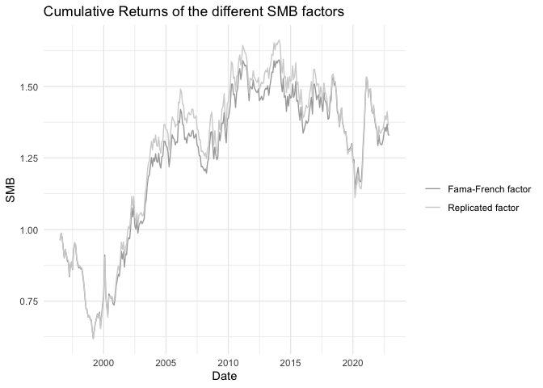

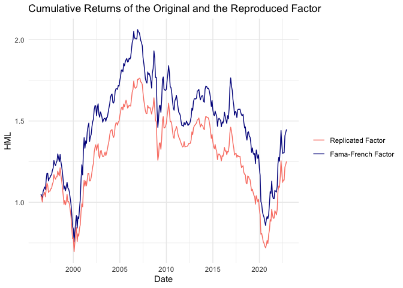
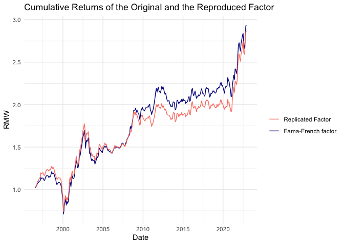

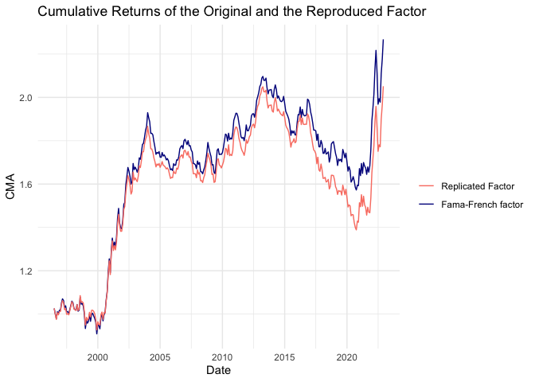

<table style="text-align:center">
<caption>
<strong>Regressions of Replicated- onto Published Factors</strong>
</caption>
<tr>
<td colspan="5" style="border-bottom: 1px solid black">
</td>
</tr>
<tr>
<td style="text-align:left">
</td>
<td colspan="4">
Factors from K. French’s Website
</td>
</tr>
<tr>
<td>
</td>
<td colspan="4" style="border-bottom: 1px solid black">
</td>
</tr>
<tr>
<td style="text-align:left">
</td>
<td>
SMB
</td>
<td>
HML
</td>
<td>
RMW
</td>
<td>
CMA
</td>
</tr>
<tr>
<td colspan="5" style="border-bottom: 1px solid black">
</td>
</tr>
<tr>
<td style="text-align:left">
SMB (rep)
</td>
<td>
0.956\*\*\*
</td>
<td>
</td>
<td>
</td>
<td>
</td>
</tr>
<tr>
<td style="text-align:left">
</td>
<td>
(0.006)
</td>
<td>
</td>
<td>
</td>
<td>
</td>
</tr>
<tr>
<td style="text-align:left">
</td>
<td>
</td>
<td>
</td>
<td>
</td>
<td>
</td>
</tr>
<tr>
<td style="text-align:left">
HML (rep)
</td>
<td>
</td>
<td>
1.023\*\*\*
</td>
<td>
</td>
<td>
</td>
</tr>
<tr>
<td style="text-align:left">
</td>
<td>
</td>
<td>
(0.017)
</td>
<td>
</td>
<td>
</td>
</tr>
<tr>
<td style="text-align:left">
</td>
<td>
</td>
<td>
</td>
<td>
</td>
<td>
</td>
</tr>
<tr>
<td style="text-align:left">
RMW (rep)
</td>
<td>
</td>
<td>
</td>
<td>
0.965\*\*\*
</td>
<td>
</td>
</tr>
<tr>
<td style="text-align:left">
</td>
<td>
</td>
<td>
</td>
<td>
(0.012)
</td>
<td>
</td>
</tr>
<tr>
<td style="text-align:left">
</td>
<td>
</td>
<td>
</td>
<td>
</td>
<td>
</td>
</tr>
<tr>
<td style="text-align:left">
CMA (rep)
</td>
<td>
</td>
<td>
</td>
<td>
</td>
<td>
0.985\*\*\*
</td>
</tr>
<tr>
<td style="text-align:left">
</td>
<td>
</td>
<td>
</td>
<td>
</td>
<td>
(0.010)
</td>
</tr>
<tr>
<td style="text-align:left">
</td>
<td>
</td>
<td>
</td>
<td>
</td>
<td>
</td>
</tr>
<tr>
<td style="text-align:left">
Constant
</td>
<td>
-0.00003
</td>
<td>
0.001
</td>
<td>
0.0001
</td>
<td>
0.0003
</td>
</tr>
<tr>
<td style="text-align:left">
</td>
<td>
(0.0002)
</td>
<td>
(0.001)
</td>
<td>
(0.0003)
</td>
<td>
(0.0002)
</td>
</tr>
<tr>
<td style="text-align:left">
</td>
<td>
</td>
<td>
</td>
<td>
</td>
<td>
</td>
</tr>
<tr>
<td colspan="5" style="border-bottom: 1px solid black">
</td>
</tr>
<tr>
<td style="text-align:left">
Observations
</td>
<td>
330
</td>
<td>
330
</td>
<td>
330
</td>
<td>
330
</td>
</tr>
<tr>
<td style="text-align:left">
R2
</td>
<td>
0.987
</td>
<td>
0.915
</td>
<td>
0.955
</td>
<td>
0.966
</td>
</tr>
<tr>
<td style="text-align:left">
Adjusted R2
</td>
<td>
0.987
</td>
<td>
0.915
</td>
<td>
0.955
</td>
<td>
0.966
</td>
</tr>
<tr>
<td style="text-align:left">
Residual Std. Error (df = 328)
</td>
<td>
0.004
</td>
<td>
0.010
</td>
<td>
0.006
</td>
<td>
0.004
</td>
</tr>
<tr>
<td style="text-align:left">
F Statistic (df = 1; 328)
</td>
<td>
24,971.270\*\*\*
</td>
<td>
3,553.302\*\*\*
</td>
<td>
7,018.902\*\*\*
</td>
<td>
9,352.846\*\*\*
</td>
</tr>
<tr>
<td colspan="5" style="border-bottom: 1px solid black">
</td>
</tr>
<tr>
<td style="text-align:left">
<em>Note:</em>
</td>
<td colspan="4" style="text-align:left">
*p&lt;0.1; **p&lt;0.05; ***p&lt;0.01
</td>
</tr>
</table>

## The intangible Factors

### Adjusted Book-Market Factor

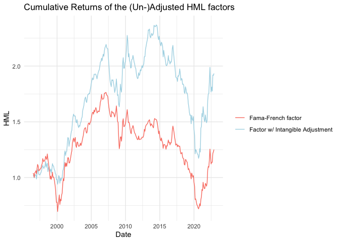 A comparison
of factors with and without industry specific intangible capital
depreciation rates
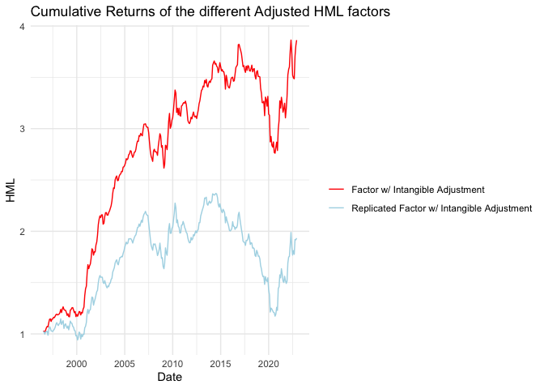

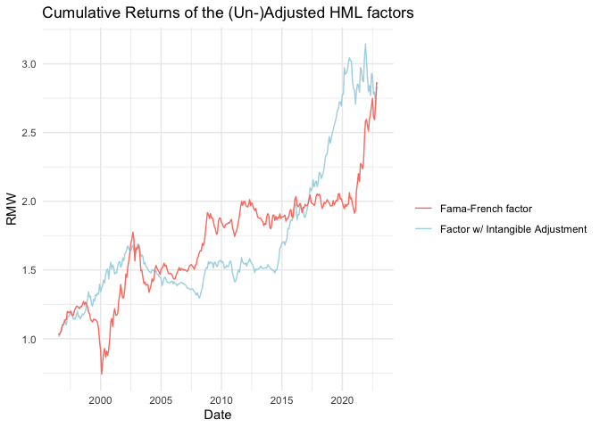 \### Adjusted
Profitability Factor

The adjusted profitability factor, based on the methodology from
Jagannathan, Korajczyk, and Wang (2023), is computed using Compustat
data as follows:

1.  **Revenue (REVT)**
2.  **Minus Cost of Goods Sold (COGS)**
3.  **Minus Selling, General and Administrative Expenses (XSGA)**
4.  **Plus Research and Development Expenses (XRD)**
5.  **Divided by Total Assets (AT)**

This can be expressed with the following formula:

$$ \text{Operating Profitability} = \frac{REVT - COGS - XSGA + XRD}{AT} $$

For the purposes of the adjusted profitability factor, they considered
different levels of SG&A adjustment. The factor with the highest
explanatory power added 30% of SG&A expenses, formulated as:

$$ \text{Adjusted Profitability} = \frac{REVT - COGS - (0.7 \times XSGA) + XRD}{AT} $$

According to the authors his adjustment improves the predictive power of
the profitability measure by capturing investments in intangibles, which
are immediately expensed under GAAP but should be considered investments
in future profitability .

BUT, the authors divide by total assets without adjusting for them
(asset adjustment is only proposed in the Wang (2023) paper, which
wasn’t published at the time). Once they are properly adjusted and all
variables are taking care of the intangibles, the factor performance has
a salient decrease.

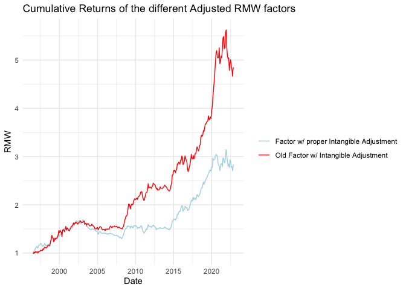

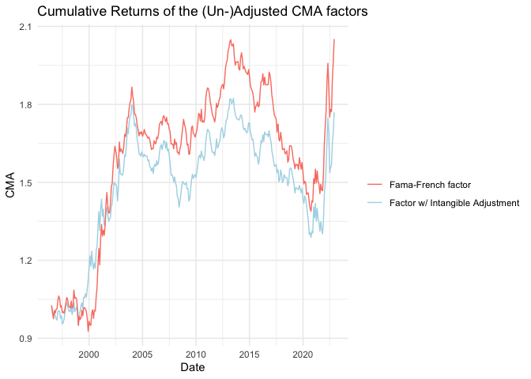

# The Liquidity “factor”

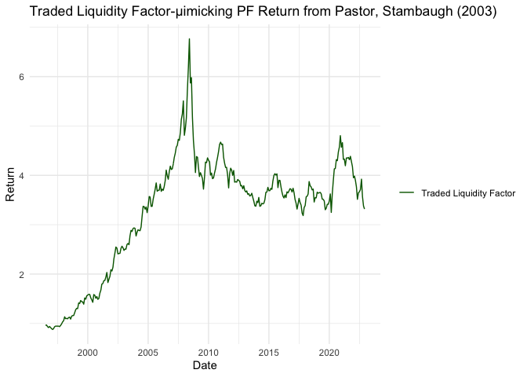

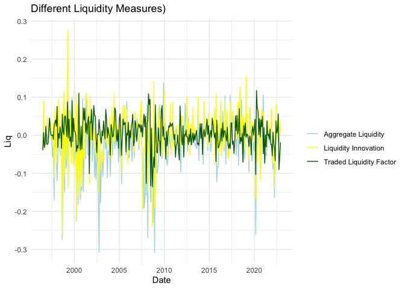

# The Dataset

    ## # A tibble: 1,491,668 × 22
    ##    permno month      industry  ret_excess mkt_excess     smb     hml     rmw
    ##     <dbl> <date>     <chr>          <dbl>      <dbl>   <dbl>   <dbl>   <dbl>
    ##  1  10001 1996-07-01 Utilities    0.0189     -0.0597 -0.0381  0.0514  0.0295
    ##  2  10001 1996-08-01 Utilities    0.0341      0.0277  0.0257 -0.0074 -0.0037
    ##  3  10001 1996-09-01 Utilities    0.0375      0.0501 -0.0139 -0.0272  0.0127
    ##  4  10001 1996-10-01 Utilities   -0.0328      0.0086 -0.0377  0.0494  0.014 
    ##  5  10001 1996-11-01 Utilities    0.0253      0.0625 -0.038   0.0139  0.0212
    ##  6  10001 1996-12-01 Utilities   -0.0640     -0.017   0.0325  0.0131  0.0037
    ##  7  10001 1997-01-01 Utilities    0.0570      0.0499 -0.0182 -0.0142  0.0119
    ##  8  10001 1997-02-01 Utilities   -0.0039     -0.0049 -0.0259  0.0567  0.0067
    ##  9  10001 1997-03-01 Utilities    0.00787    -0.0503 -0.0043  0.0339  0.005 
    ## 10  10001 1997-04-01 Utilities   -0.0043      0.0404 -0.057   0.0007  0.0326
    ## # ℹ 1,491,658 more rows
    ## # ℹ 14 more variables: cma <dbl>, smb_replicated <dbl>, hml_replicated <dbl>,
    ## #   rmw_replicated <dbl>, cma_replicated <dbl>, smb_int_replicated <dbl>,
    ## #   hml_int_replicated <dbl>, rmw_int <dbl>, rmw_intOLD <dbl>, cma_int <dbl>,
    ## #   AggLiq <dbl>, LiqInno <dbl>, LiqTrad <dbl>, hml_int <dbl>

# Fama-Macbeth Regressions

To garuantee comparability of the results the excess returns analysed
are from the different industry portfolios according to K. French’s
website.

1.  Producing the *β*′*s*:

$$ r\_{i,t} -  r\_{f,t}= \alpha + \sum^k\_{j = 1}\beta\_{i,j} f\_{i,t} + \epsilon\_{i,t}, $$

where *f* = (*H**M**L*,*S**M**B*,*R**M**W*,*C**M**A*).

1.  Exposures as explanatory variables in *T* cross-sectional
    regressions. Now *r**i*, *t* represents the excess
    return.

*r**i*, *t* + 1 = *α**i* + *λ**t**M**β**i*, *t**M* + *λ**t**S**M**B**β**i*, *t**S**M**B* + *λ**t**H**M**L**β**i*, *t**H**M**L* + *λ**t**R**M**W**β**i*, *t**R**M**W* +  + *λ**t**C**M**A**β**i*, *t**C**M**A*

This gives us the estimator of interest: the
compensation*λ**t**f* for the exposure to each
risk factor *β**i*, *t**f* at each point in time
(THE RISK PREMIUM)

If there is a linear relationship between expected returns and the
characteristic in a given month, we expect the regression coefficient to
reflect the relationship, i.e., *λ**t**f* ≠ 0.

1.  Get the time-series average

$$ \frac{1}{T} \sum\_{t=1}^T \hat{\lambda}\_t^f $$
of the averages *λ̂**t**f* which then can be
interpreted as the risk premium for the specific risk factor f

# State-Space Model

Define the state-space model with liquidity influencing the factor
loadings. The state-space particle filter approach is beneficial,
because of the inclusion of the latent liquidity influence, but also
because it allows me to produce entire distributions of the factor
exposures independently from how they are distributed (i.e, not only
point estimator under Gaussian distribution). This can produce valuable
insights on the factor exposure dynamics.

## State Equation

The state equation models the latent influence of liquidity on the
factor exposures.

\[ *{j,t} = *{j,t-1} + *j L\_t + *{j,t}, *{j,t} (0, *{\_j}^2)\]

## Observation Equation

The observation equation models the returns as a function of the
Fama-French five factors, with the factor loadings influenced by the
latent state.

\[ R\_{i,t} = *{0,i} + *{j=1}^5 (*{j,i} + *j *{j,t}) F*{j,t} + *{i,t},
*{i,t} (0, \_R^2)\]

# Particle Filter Process

## Initialization

Initialize (N) particles representing the initial belief about the
latent influences of liquidity.

## Prediction Step

Propagate each particle according to the state equation.

\[ *{j,t}^n = *{j,t-1}^n + *j L\_t + *{j,t}^n, *{j,t}^n (0, *{\_j}^2),
n\]

## Update Step

Update the weights of each particle based on the observation equation.

\[ w\_t^n = w\_{t-1}^n *{i=1}^M p(R*{i,t} | *{1,t}^n, *{2,t}^n, ,
\_{5,t}^n, ), n\]

## Normalization

Normalize the weights:

\[ t^n = , n\]

## Resampling

Resample the particles based on their weights to avoid degeneracy.

## Estimation

Estimate the state at each time step by taking the weighted average of
the particles.

\[ = ^N t^n ^n\]

# Cross-Sectional GMM Regression

Use the estimated factor loadings from the particle filter as the
dependent variables in the cross-sectional regression, with lagged
factors and lagged liquidity as instruments.

## GMM Setup

Instead of Cross sectional OLS/WLS regression for the Fama-Macbeth
system, the GMM framework allows for a continuation of non-Gaussian
analysis. Define the moment conditions for the cross-sectional GMM:

\[ E\[z\_{t-1} (R\_{i,t} - *{0,i} - *{j=1}^5 *{j,i} F*{j,t})\] = 0\]

where (z\_{t-1}) are the instruments (lagged factors and lagged
liquidity).

## (CRSP and COMPUSTAT) DATASETS for FACTOR CONSTRUCTION

Datasets in ‚Intangible Value‘ to construct the factors:

### 1. crsp.msf:

    •   Name: Monthly Stock File
    •   Content: Contains historical monthly stock data, including returns, prices, shares outstanding, trading volume, and other key stock performance metrics.
    •   Coverage: This dataset has been the standard for CRSP monthly stock data for many years.
    •   Usage: It is widely used for historical stock performance analysis, academic research, and financial modeling.

### 2. crsp.msf\_v2:

    •   Name: Monthly Stock File Version 2
    •   Content: Contains similar historical monthly stock data as crsp.msf but includes updates, corrections, and potentially new variables that were not present in the original crsp.msf.
    •   Coverage: It may provide more accurate or more comprehensive data compared to the older crsp.msf version.
    •   Usage: It is intended to offer improved data quality and completeness, thus providing users with a more reliable dataset for their analyses.

Key Differences:

    •   Data Quality and Updates: crsp.msf_v2 is likely to include enhancements, error corrections, and additional variables not found in crsp.msf.
    •   Versioning: crsp.msf_v2 represents an updated version of the original monthly stock file dataset, reflecting CRSP’s efforts to improve their data offerings.

When choosing between the two, it is generally recommended to use
crsp.msf\_v2 if you need the most up-to-date and accurate data for your
research or analysis. However, if you have a historical analysis or
comparison that began with crsp.msf, you might want to continue using it
for consistency.

### crsp.mse (Monthly Stock Event File)

    •   Content: The crsp.mse dataset contains information about significant events affecting stocks on a monthly basis. These events can include dividends, stock splits, mergers, acquisitions, spin-offs, and other corporate actions.
    •   Variables: Typical variables in the crsp.mse file may include:
    •   Event date
    •   Event type (e.g., dividend, stock split, merger)
    •   Event-specific details (e.g., split ratio, dividend amount)
    •   Identifiers for the affected securities (e.g., permno, ticker symbol)
    •   Usage: This dataset is useful for researchers and analysts who need to understand the impact of corporate events on stock performance. It helps in tracking how events influence stock prices, returns, and other financial metrics.
    •   Coverage: The dataset covers various corporate events over time, providing a historical perspective on how these events have affected the market.

Key Points

    •   Event Tracking: crsp.mse is essential for studying the impact of corporate events on stocks. It allows for detailed analysis of how events like dividends and stock splits affect stock behavior.
    •   Integration with Other Datasets: This dataset can be combined with other CRSP datasets (e.g., crsp.msf or crsp.dsf) to conduct comprehensive analyses that account for both regular stock performance and specific events.
    •   Research Applications: It is widely used in academic research, particularly in finance and economics, for studies related to corporate actions, market efficiency, and event studies.

In summary, crsp.mse is a valuable dataset for analyzing the effects of
significant corporate events on stock performance on a monthly basis,
providing insights into how such events influence market behavior.

### crsp.msedelist (Monthly Stock Event Delisting File)

    •   Content: The crsp.msedelist dataset contains detailed information about delisting events of securities. Delisting refers to the removal of a stock from a stock exchange, which can happen for various reasons such as mergers, acquisitions, bankruptcies, or failure to meet exchange listing requirements.
    •   Variables: Typical variables in the crsp.msedelist file may include:
    •   PERMNO: Permanent identifier assigned by CRSP to each security.
    •   Event Date: The date on which the delisting event occurred.
    •   Delisting Code: A code indicating the reason for delisting (e.g., merger, liquidation, failure to meet listing standards).
    •   Delisting Return: The return on the stock from the last trading date to the delisting date.
    •   Delisting Price: The price of the stock at the time of delisting.
    •   Delisting Market: The market from which the stock was delisted.
    •   Usage: This dataset is particularly useful for understanding the final outcomes of securities that are no longer traded on the exchange. Researchers and analysts can use it to study the causes and consequences of delistings, including their impact on shareholders and market performance.
    •   Coverage: The dataset covers a comprehensive history of delisting events, providing valuable insights into the lifecycle of publicly traded companies and the reasons behind their removal from exchanges.

Key Points

    •   Delisting Analysis: crsp.msedelist is essential for analyzing the delisting events of stocks, offering detailed data on why and when stocks are removed from exchanges.
    •   Research Applications: It is widely used in financial research to study topics such as the risk and return of delisted stocks, the impact of corporate actions leading to delisting, and the behavior of stocks before and after delisting.
    •   Integration with Other Datasets: This dataset can be used alongside other CRSP datasets like crsp.msf (Monthly Stock File) and crsp.mse (Monthly Stock Event File) to perform comprehensive analyses that track the entire history of a stock from listing through delisting.

In summary, crsp.msedelist is a valuable dataset for examining the
delisting events of stocks, providing detailed information on the
reasons and consequences of delistings. It is widely used in financial
and economic research to gain insights into the lifecycle and final
outcomes of publicly traded securities.

### crsp.ccmxpf\_lnkhist (Link History File)

    •   Content: Contains historical link information between CRSP and Compustat identifiers, tracking changes over time.
    •   Variables:
    •   GVKEY: Compustat’s unique identifier for companies.
    •   PERMNO: CRSP’s unique identifier for securities.
    •   PERMCO: CRSP’s unique identifier for companies.
    •   Link Type: Indicates the type of link between CRSP and Compustat data (e.g., primary link, secondary link).
    •   Link Date Range: The start and end dates for which the link is valid.
    •   Link Status: Indicates the status of the link (e.g., active, inactive).
    •   Usage: Essential for historical research where the correct linkage between CRSP and Compustat data must be maintained over time. Useful for studies requiring accurate historical data matching, considering changes in company identifiers.

### crsp.ccmxpf\_linktable (Link Table)

    •   Content: Provides a more simplified and current linkage between CRSP and Compustat identifiers, without the historical tracking of link changes.
    •   Variables:
    •   GVKEY: Compustat’s unique identifier for companies.
    •   PERMNO: CRSP’s unique identifier for securities.
    •   PERMCO: CRSP’s unique identifier for companies.
    •   Link Type: Indicates the type of link (e.g., primary link, secondary link).
    •   Link Date Range: The start and end dates for which the link is valid.
    •   Usage: Ideal for current or static research projects where historical link changes are not a concern. Suitable for straightforward data merging for recent periods.

Key Differences

    •   Historical Tracking:
    •   crsp.ccmxpf_lnkhist includes historical link changes, providing a record of how links between CRSP and Compustat identifiers have evolved over time.
    •   crsp.ccmxpf_linktable typically offers a more simplified, current linkage without the detailed historical changes.
    •   Use Cases:
    •   Use crsp.ccmxpf_lnkhist for research requiring accurate historical linkages, where changes over time are important (e.g., long-term studies, historical event studies).
    •   Use crsp.ccmxpf_linktable for more recent or static analyses where historical changes in linkages are not relevant (e.g., recent financial analysis, static dataset merges).

Summary

    •   crsp.ccmxpf_lnkhist: Historical link information, detailed tracking of linkage changes, useful for accurate historical research.
    •   crsp.ccmxpf_linktable: Simplified, current link information, suitable for recent and straightforward data merges.

Choosing between these datasets depends on the specific needs of your
research, particularly whether historical changes in linkages between
CRSP and Compustat data are important for your analysis.

### comp.funda

    •   Content: Contains detailed annual financial statement data for publicly traded companies, including balance sheets, income statements, cash flow statements, and other key financial metrics.
    •   Variables: Some of the common variables in comp.funda include:
    •   GVKEY: Global Company Key, a unique identifier assigned by Compustat to each company.
    •   Fiscal Year: The fiscal year for which the data is reported.
    •   Data Items:
    •   Assets: Total assets (AT).
    •   Liabilities: Total liabilities (LT).
    •   Equity: Shareholders’ equity (SEQ).
    •   Revenue: Total revenue (REVT).
    •   Net Income: Net income (NI).
    •   Earnings per Share (EPS): Basic earnings per share (EPSPX) and diluted earnings per share (EPSFX).
    •   Cash Flow: Cash flow from operations (OANCF), cash flow from investing activities (IVNCF), and cash flow from financing activities (FINCF).
    •   Sales: Net sales or revenue (SALE).
    •   Operating Income: Operating income before depreciation (OIBDP).
    •   Depreciation: Depreciation and amortization (DP).
    •   Coverage: Includes data for a wide range of companies across various industries, providing extensive coverage of financial information.
    •   Usage:
    •   Financial Analysis: Used for detailed financial analysis and modeling, such as ratio analysis, profitability analysis, and growth analysis.
    •   Academic Research: Widely used in academic research to study corporate finance, accounting, economics, and related fields.
    •   Investment Research: Utilized by investment professionals for fundamental analysis to inform investment decisions.

Example Data Items

Here are a few example data items you might find in comp.funda:

    •   Assets (AT): The total assets of the company.
    •   Liabilities (LT): The total liabilities of the company.
    •   Shareholders’ Equity (SEQ): The equity held by shareholders.
    •   Net Sales/Revenue (SALE): The total sales or revenue generated by the company.
    •   Operating Income (OIBDP): The income generated from operations before depreciation.
    •   Net Income (NI): The company’s net income.
    •   Earnings per Share - Basic (EPSPX): Basic earnings per share.
    •   Cash Flow from Operations (OANCF): Cash flow generated from operational activities.

Summary

The comp.funda dataset is an essential resource for obtaining
comprehensive annual financial statement data for publicly traded
companies in the US and Canada. It provides a wealth of financial
information that is crucial for conducting thorough financial analyses,
academic research, and investment research.

### crsp.tfz\_mth\_cpi (Monthly Consumer Price Index File)

    •   Content: This dataset contains monthly data on the Consumer Price Index (CPI), which measures changes in the price level of a basket of consumer goods and services purchased by households. The CPI is a crucial indicator of inflation and is used to adjust economic indicators for inflation, analyze real economic activity, and index economic series to maintain purchasing power.
    •   Variables: Common variables in the crsp.tfz_mth_cpi dataset include:
    •   Date: The month and year for the CPI data point.
    •   CPI: The Consumer Price Index value for that month.
    •   CPI Adjusted Values: Values adjusted for inflation using the CPI, often provided for different base years.
    •   Coverage: The dataset typically covers a long historical period, providing a comprehensive view of inflation over time.
    •   Usage:
    •   Economic Analysis: Used to study inflation trends, adjust nominal values for inflation, and analyze the real purchasing power of money.
    •   Financial Research: Helps in deflating nominal financial metrics to real terms, enabling more accurate financial and economic analysis.
    •   Indexation: Used for indexing economic series, such as wages or contracts, to maintain their real value over time.

Key Points

    •   Inflation Measurement: The CPI is a key measure of inflation, reflecting the changes in the cost of living.
    •   Data Integration: The CPI data can be integrated with other financial datasets to adjust for inflation and analyze real values. For example, researchers can adjust stock returns, corporate earnings, or economic indicators to reflect real rather than nominal changes.
    •   Research Applications: This dataset is widely used in macroeconomic research, financial analysis, and policy-making to understand and adjust for inflation.

Example Variables

Here are some typical variables you might find in the crsp.tfz\_mth\_cpi
dataset:

    •   DATE: The month and year of the CPI observation (e.g., 1994-01 for January 1994).
    •   CPI: The Consumer Price Index value for that month (e.g., 154.5).
    •   ADJUSTED VALUES: CPI-adjusted values, often provided to facilitate inflation-adjusted analyses.

Summary

The crsp.tfz\_mth\_cpi dataset is an essential resource for obtaining
monthly Consumer Price Index data, which is crucial for analyzing
inflation and adjusting economic and financial data for real value
assessments. This dataset is valuable for researchers, economists, and
financial analysts who need to incorporate inflation measures into their
analyses.
