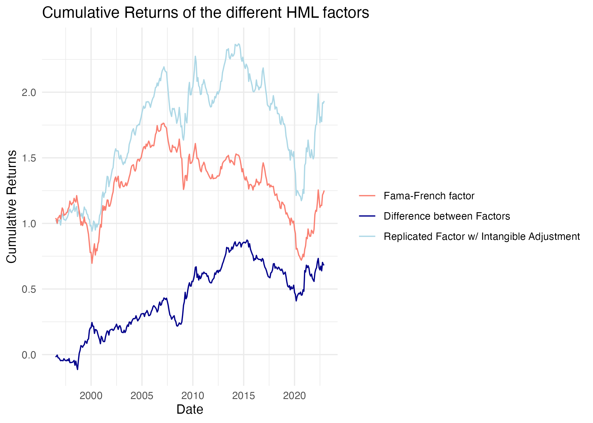

# Pricing-Intangibles

**To Do:**

-   [ ] Download LIQ Factor

```{=html}
<!-- -->
```
-   [ ] Write 'ReadMe's' for every auxiliary File

```{=html}
<!-- -->
```
-   [ ] Find out how to produce them with plots (-\> maybe straight KNitR them?)

-   [ ] Do the LIQ \~ F_INT, & LIQ \~ FF regressions

-   [ ] Fucking get behind how to fix this fucking shit of a whore piece of git connection without suing github desktop those bunch of motherless sloths. die -\> did it (will keep this as a memento tho)

-   [ ] Show the difference of the Factors when RMW is divided by be, or by be_int

-   [ ] MY BROTHER IN CHRIST: we forgot about the market factor. (did we?) -\> check this straight after coming back from the doc!

List of test plots:

All the recreated fama french factors with the originals.

All the intangible factors with the recreated fff.

The two different rmw_int factors

\
