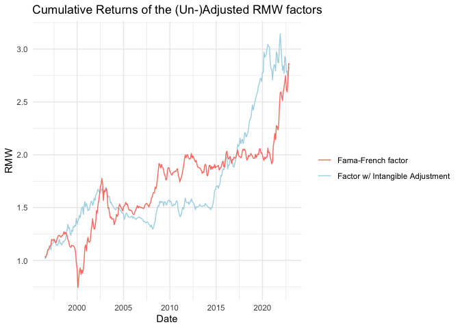

## Pricing-Intangibles

To Do:

Download LIQ Factor

\[ \] Write ‘ReadMe’s’ for every auxiliary File

Find out how to produce them with plots (-&gt; maybe straight KNitR
them?)

Do the LIQ ~ F\_INT, & LIQ ~ FF regressions

Fucking get behind how to fix this fucking shit of a whore piece of git
connection without suing github desktop those bunch of motherless
sloths. die -&gt; did it (will keep this as a memento tho)

Show the difference of the Factors when RMW is divided by be, or by
be\_int

MY BROTHER IN CHRIST: we forgot about the market factor. (did we?) -&gt;
check this straight after coming back from the doc!

\#List of test plots:

\[x\] All the recreated fama french factors with the originals.

\[x\] All the intangible factors with the recreated fff.

\[x\] The two different rmw\_int factors

(\[x\] The different HML Factors)

\[x\] The Traded Liquidity Factor

\#List of all the test tables:

\[ \] All the recreated factors with the originals

\[ \] Liq ~ FF5 OG

\[ \] Liq ~ FF5 Int

\#List of all factors and their composition:

\[\] All the original FF5

\[\] All the Int FF5 recreated

\[\] HML original and RMW Original

\[\] The Liquidity Factor

    summary(cars)

    ##      speed           dist       
    ##  Min.   : 4.0   Min.   :  2.00  
    ##  1st Qu.:12.0   1st Qu.: 26.00  
    ##  Median :15.0   Median : 36.00  
    ##  Mean   :15.4   Mean   : 42.98  
    ##  3rd Qu.:19.0   3rd Qu.: 56.00  
    ##  Max.   :25.0   Max.   :120.00

## Reproduction of Factors

<table style="text-align:center">
<tr>
<td colspan="5" style="border-bottom: 1px solid black">
</td>
</tr>
<tr>
<td style="text-align:left">
</td>
<td colspan="4">
<em>Dependent variable:</em>
</td>
</tr>
<tr>
<td>
</td>
<td colspan="4" style="border-bottom: 1px solid black">
</td>
</tr>
<tr>
<td style="text-align:left">
</td>
<td>
smb
</td>
<td>
hml
</td>
<td>
rmw
</td>
<td>
cma
</td>
</tr>
<tr>
<td style="text-align:left">
</td>
<td>
\(1\)
</td>
<td>
\(2\)
</td>
<td>
\(3\)
</td>
<td>
\(4\)
</td>
</tr>
<tr>
<td colspan="5" style="border-bottom: 1px solid black">
</td>
</tr>
<tr>
<td style="text-align:left">
smb\_replicated
</td>
<td>
0.956\*\*\*
</td>
<td>
</td>
<td>
</td>
<td>
</td>
</tr>
<tr>
<td style="text-align:left">
</td>
<td>
(0.006)
</td>
<td>
</td>
<td>
</td>
<td>
</td>
</tr>
<tr>
<td style="text-align:left">
</td>
<td>
</td>
<td>
</td>
<td>
</td>
<td>
</td>
</tr>
<tr>
<td style="text-align:left">
hml\_replicated
</td>
<td>
</td>
<td>
1.023\*\*\*
</td>
<td>
</td>
<td>
</td>
</tr>
<tr>
<td style="text-align:left">
</td>
<td>
</td>
<td>
(0.017)
</td>
<td>
</td>
<td>
</td>
</tr>
<tr>
<td style="text-align:left">
</td>
<td>
</td>
<td>
</td>
<td>
</td>
<td>
</td>
</tr>
<tr>
<td style="text-align:left">
rmw\_replicated
</td>
<td>
</td>
<td>
</td>
<td>
0.965\*\*\*
</td>
<td>
</td>
</tr>
<tr>
<td style="text-align:left">
</td>
<td>
</td>
<td>
</td>
<td>
(0.012)
</td>
<td>
</td>
</tr>
<tr>
<td style="text-align:left">
</td>
<td>
</td>
<td>
</td>
<td>
</td>
<td>
</td>
</tr>
<tr>
<td style="text-align:left">
cma\_replicated
</td>
<td>
</td>
<td>
</td>
<td>
</td>
<td>
0.985\*\*\*
</td>
</tr>
<tr>
<td style="text-align:left">
</td>
<td>
</td>
<td>
</td>
<td>
</td>
<td>
(0.010)
</td>
</tr>
<tr>
<td style="text-align:left">
</td>
<td>
</td>
<td>
</td>
<td>
</td>
<td>
</td>
</tr>
<tr>
<td style="text-align:left">
Constant
</td>
<td>
-0.00003
</td>
<td>
0.001
</td>
<td>
0.0001
</td>
<td>
0.0003
</td>
</tr>
<tr>
<td style="text-align:left">
</td>
<td>
(0.0002)
</td>
<td>
(0.001)
</td>
<td>
(0.0003)
</td>
<td>
(0.0002)
</td>
</tr>
<tr>
<td style="text-align:left">
</td>
<td>
</td>
<td>
</td>
<td>
</td>
<td>
</td>
</tr>
<tr>
<td colspan="5" style="border-bottom: 1px solid black">
</td>
</tr>
<tr>
<td style="text-align:left">
Observations
</td>
<td>
330
</td>
<td>
330
</td>
<td>
330
</td>
<td>
330
</td>
</tr>
<tr>
<td style="text-align:left">
R2
</td>
<td>
0.987
</td>
<td>
0.915
</td>
<td>
0.955
</td>
<td>
0.966
</td>
</tr>
<tr>
<td style="text-align:left">
Adjusted R2
</td>
<td>
0.987
</td>
<td>
0.915
</td>
<td>
0.955
</td>
<td>
0.966
</td>
</tr>
<tr>
<td style="text-align:left">
Residual Std. Error (df = 328)
</td>
<td>
0.004
</td>
<td>
0.010
</td>
<td>
0.006
</td>
<td>
0.004
</td>
</tr>
<tr>
<td style="text-align:left">
F Statistic (df = 1; 328)
</td>
<td>
24,971.270\*\*\*
</td>
<td>
3,553.302\*\*\*
</td>
<td>
7,018.902\*\*\*
</td>
<td>
9,352.846\*\*\*
</td>
</tr>
<tr>
<td colspan="5" style="border-bottom: 1px solid black">
</td>
</tr>
<tr>
<td style="text-align:left">
<em>Note:</em>
</td>
<td colspan="4" style="text-align:right">
*p&lt;0.1; **p&lt;0.05; ***p&lt;0.01
</td>
</tr>
</table>

## The intangible Factors

# The Liquidity “factor”

